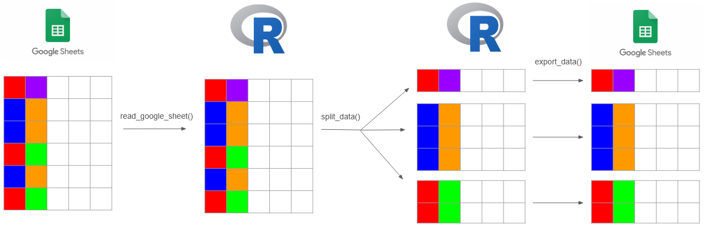

<!-- README.md is generated from README.Rmd. Please edit that file -->

```{r, include = FALSE}
knitr::opts_chunk$set(
  collapse = TRUE,
  comment = "#>",
  fig.path = "man/figures/README-",
  out.width = "100%"
)
```

# headhoncho

<!-- badges: start -->
[](https://github.com/tchang73/headhoncho/actions/workflows/R-CMD-check.yaml)
<!-- badges: end -->

The headhoncho package aims to help split one Google sheet into multiple Google sheets based on one (or more) variables. Functions within the package aim to make a smooth experience with the `googlesheets4` API.

## Installation

You can install the development version of headhoncho from [GitHub](https://github.com/) with:

```{r, eval = FALSE}
# install.packages("devtools")
devtools::install_github("tchang73/headhoncho")
```

## General workflow

The `headhoncho` package allows you to read a Google sheet into R, split it based on specified variable(s), and export it into multiple, separate, Google sheets. It is built on functionality from `tidyverse`'s `googlesheets4` package. The general workflow looks like this:


## Loading in the package

Like most R packages, it is best to load the `headhoncho` package in with the `library()` function.

```{r}
library(headhoncho)
```

## Reading in sheets

The `read_google_sheet` can be used to read in data from a URL. It will also check for read and write authentication for a Google account.

```{r, eval = FALSE}
read_google_sheet("https://docs.google.com/spreadsheets/d/1U6Cf_qEOhiR9AZqTqS3mbMF3zt2db48ZP5v3rkrAEJY/edit#gid=780868077")
```

## Splitting data

The `split_data` function splits a data frame into a list of smaller data frames based on groupings from given variable(s). The provided `pokeacademy_data` data set will be used to demonstrate. We'll split on two variables to show the functionality.

```{r example}
head(pokeacademy_data)

split_data <- split_sheet(pokeacademy_data, pokeacademy_data$Citizenship_DESC, pokeacademy_data$Student_Type)

print(lapply(split_data, head))
```

## Exporting data

The `export_data` function can be used to export a list of data frames into multiple different Google sheets. The usage can be seen below, but the code will not be run in order to avoid writing to a ton of different Google sheets.

```{r, eval = FALSE}
export_data(split_data)
```
