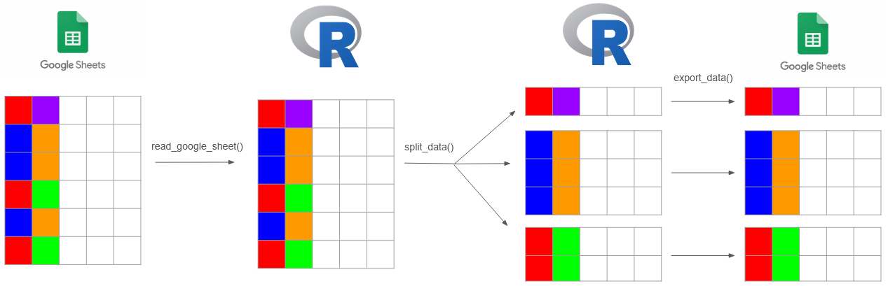

<!-- README.md is generated from README.Rmd. Please edit that file -->

# headhoncho

<!-- badges: start -->

[](https://github.com/tchang73/headhoncho/actions/workflows/R-CMD-check.yaml)
<!-- badges: end -->

The headhoncho package aims to help split one Google sheet into multiple
Google sheets based on one (or more) variables. Functions within the
package aim to make a smooth experience with the `googlesheets4` API.

## Installation

You can install the development version of headhoncho from
[GitHub](https://github.com/) with:

``` r
# install.packages("devtools")
devtools::install_github("tchang73/headhoncho")
```

## General workflow

The `headhoncho` package allows you to read a Google sheet into R, split
it based on specified variable(s), and export it into multiple,
separate, Google sheets. It is built on functionality from `tidyverse`’s
`googlesheets4` package. The general workflow looks like this:

<figure>

<figcaption aria-hidden="true">Graphic of headhoncho package
workflow</figcaption>
</figure>

## Loading in the package

Like most R packages, it is best to load the `headhoncho` package in
with the `library()` function.

``` r
library(headhoncho)
```

## Authentication

The `headhoncho` package will automatically use the `googlesheets4`
authentication process the first time that an action requiring
authentication is performed. Generally, this is through the `gs4_auth()`
function. For this documentation, we have not authenticated and will
just provide example code.

## Reading in sheets

The `read_google_sheet` can be used to read in data from a Google sheets
ID, typically provided either as a URL or part of a URL. Typically, you
need to authenticate to do this. In this case, since we are accessing a
publicly available example Google sheet, we don’t need to authenticate,
which we have indicated to the API in a hidden code chunk. In general,
it is a smarter (but not 100% necessary) idea to authenticate.

``` r
# Full URL: https://docs.google.com/spreadsheets/d/1HO3e_VCqdbyRGbKOgzt57aLLlhVCP7YQGmy411tqGNc
example_data <- read_google_sheet("1HO3e_VCqdbyRGbKOgzt57aLLlhVCP7YQGmy411tqGNc")
#> ✔ Reading from "headhoncho package example data".
#> ✔ Range 'full_data'.
#> Access to Google Sheet successful! Reading contents...
head(example_data)
#> # A tibble: 6 × 9
#>   Last_Name First_Name Student_Type   Hall       Room Room_Type Citizenship_DESC
#>   <chr>     <chr>      <chr>          <chr>     <dbl> <chr>     <chr>           
#> 1 Hardy     Rosalinda  Ent First Year Togepi H…   508 Quadruple Domestic        
#> 2 Pierce    Christa    Ent First Year Squirtle…   209 Single    Domestic        
#> 3 Patrick   Heriberto  Ent First Year Ho-Oh Ho…   306 Quadruple Domestic        
#> 4 Mason     Stefan     Ent First Year Umbreon …   212 Triple    Domestic        
#> 5 Booth     Mike       Ent First Year Gengar H…   302 Triple    Domestic        
#> 6 Mitchell  Janice     Ent First Year Bayleef …   212 Single    Domestic        
#> # ℹ 2 more variables: DOB <dttm>, Email <chr>
```

## Splitting data

The `split_data` function splits a data frame into a list of smaller
data frames based on groupings from given variable(s). The provided
`pokeacademy_data` data set will be used to demonstrate. We’ll split on
two variables to show the functionality. We will print only the first 6
rows for readability.

``` r
head(pokeacademy_data)
#>   Last_Name First_Name   Student_Type           Hall Room Room_Type
#> 1     Hardy  Rosalinda Ent First Year   Togepi House  508 Quadruple
#> 2    Pierce    Christa Ent First Year Squirtle House  209    Single
#> 3   Patrick  Heriberto Ent First Year    Ho-Oh House  306 Quadruple
#> 4     Mason     Stefan Ent First Year  Umbreon House  212    Triple
#> 5     Booth       Mike Ent First Year   Gengar House  302    Triple
#> 6  Mitchell     Janice Ent First Year  Bayleef House  212    Single
#>   Citizenship_DESC        DOB                     Email
#> 1         Domestic  6/15/1994    rhardy@pokeacademy.edu
#> 2         Domestic  8/10/2001   cpierce@pokeacademy.edu
#> 3         Domestic   3/6/1993  hpatrick@pokeacademy.edu
#> 4         Domestic   6/9/1994    smason@pokeacademy.edu
#> 5         Domestic 10/30/2003    mbooth@pokeacademy.edu
#> 6         Domestic 11/20/2006 jmitchell@pokeacademy.edu

split_data <- split_sheet(pokeacademy_data, pokeacademy_data$Citizenship_DESC, pokeacademy_data$Student_Type)

print(lapply(split_data, head))
#> $`Domestic.Ent First Year`
#>   Last_Name First_Name   Student_Type           Hall Room Room_Type
#> 1     Hardy  Rosalinda Ent First Year   Togepi House  508 Quadruple
#> 2    Pierce    Christa Ent First Year Squirtle House  209    Single
#> 3   Patrick  Heriberto Ent First Year    Ho-Oh House  306 Quadruple
#> 4     Mason     Stefan Ent First Year  Umbreon House  212    Triple
#> 5     Booth       Mike Ent First Year   Gengar House  302    Triple
#> 6  Mitchell     Janice Ent First Year  Bayleef House  212    Single
#>   Citizenship_DESC        DOB                     Email
#> 1         Domestic  6/15/1994    rhardy@pokeacademy.edu
#> 2         Domestic  8/10/2001   cpierce@pokeacademy.edu
#> 3         Domestic   3/6/1993  hpatrick@pokeacademy.edu
#> 4         Domestic   6/9/1994    smason@pokeacademy.edu
#> 5         Domestic 10/30/2003    mbooth@pokeacademy.edu
#> 6         Domestic 11/20/2006 jmitchell@pokeacademy.edu
#> 
#> $`International.Ent First Year`
#>    Last_Name First_Name   Student_Type           Hall Room Room_Type
#> 26   Barrera    Kristin Ent First Year   Zapdos House  311    Triple
#> 28   Pollard    Candice Ent First Year   Togepi House  508    Triple
#> 31      Luna     Fabian Ent First Year Caterpie House  502    Single
#> 36  Marshall       Erik Ent First Year Caterpie House  306 Quadruple
#> 45       Liu    Brianna Ent First Year  Wailord House  310    Single
#> 49   Cochran       Luis Ent First Year Clefairy House  303    Double
#>    Citizenship_DESC       DOB                     Email
#> 26    International 8/14/1997  kbarrera@pokeacademy.edu
#> 28    International 6/27/2001  cpollard@pokeacademy.edu
#> 31    International 9/11/1991     fluna@pokeacademy.edu
#> 36    International 3/11/2003 emarshall@pokeacademy.edu
#> 45    International 9/26/1994      bliu@pokeacademy.edu
#> 49    International  1/7/2004  lcochran@pokeacademy.edu
#> 
#> $`Domestic.Ent Transfer`
#>    Last_Name First_Name Student_Type          Hall Room Room_Type
#> 16    Graves    Gabriel Ent Transfer  Piplup House  101    Single
#> 20 Hendricks      Jesse Ent Transfer Leafeon House  109    Triple
#> 50   Gilmore       Liam Ent Transfer Umbreon House  404    Double
#> 64   Lindsey      Devon Ent Transfer Wailord House  408    Single
#> 65    Forbes      Aliya Ent Transfer  Raichu House  502    Double
#> 67    Hudson    Maranda Ent Transfer  Regice House  108    Single
#>    Citizenship_DESC        DOB                      Email
#> 16         Domestic  2/24/2004    ggraves@pokeacademy.edu
#> 20         Domestic  6/25/1991 jhendricks@pokeacademy.edu
#> 50         Domestic  1/25/1991   lgilmore@pokeacademy.edu
#> 64         Domestic 11/29/2006   dlindsey@pokeacademy.edu
#> 65         Domestic  7/24/1996    aforbes@pokeacademy.edu
#> 67         Domestic  9/22/1999    mhudson@pokeacademy.edu
#> 
#> $`International.Ent Transfer`
#>    Last_Name First_Name Student_Type           Hall Room Room_Type
#> 8     Ibarra     Lillie Ent Transfer    Ditto House  103    Triple
#> 18  Gallegos     Ernest Ent Transfer Torterra House  212    Triple
#> 21    Krause      Daisy Ent Transfer   Zapdos House  308    Single
#> 22     Gates   Kiersten Ent Transfer   Pidgey House  413 Quadruple
#> 37    Lester     Hayden Ent Transfer  Wailord House  304    Single
#> 57     Garza    Tiffany Ent Transfer   Zapdos House  302    Single
#>    Citizenship_DESC        DOB                     Email
#> 8     International  3/23/2000   libarra@pokeacademy.edu
#> 18    International  11/3/2006 egallegos@pokeacademy.edu
#> 21    International  6/25/1992   dkrause@pokeacademy.edu
#> 22    International 11/23/1993    kgates@pokeacademy.edu
#> 37    International 12/21/2005   hlester@pokeacademy.edu
#> 57    International   4/7/2005    tgarza@pokeacademy.edu
```

## Exporting data

The `export_data` function can be used to export a list of data frames
into multiple different Google sheets. The usage can be seen below, but
the code will not be run in order to avoid writing to a ton of different
Google sheets.

``` r
export_data(split_data)
```
